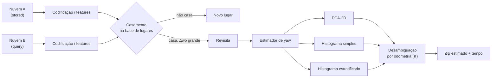
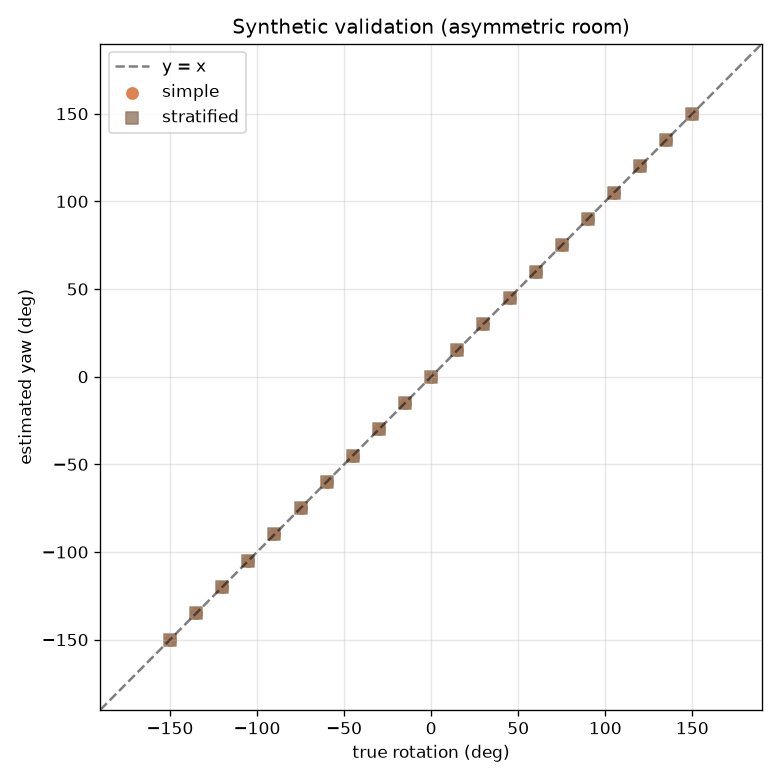
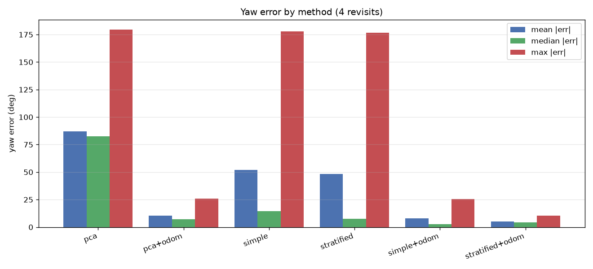
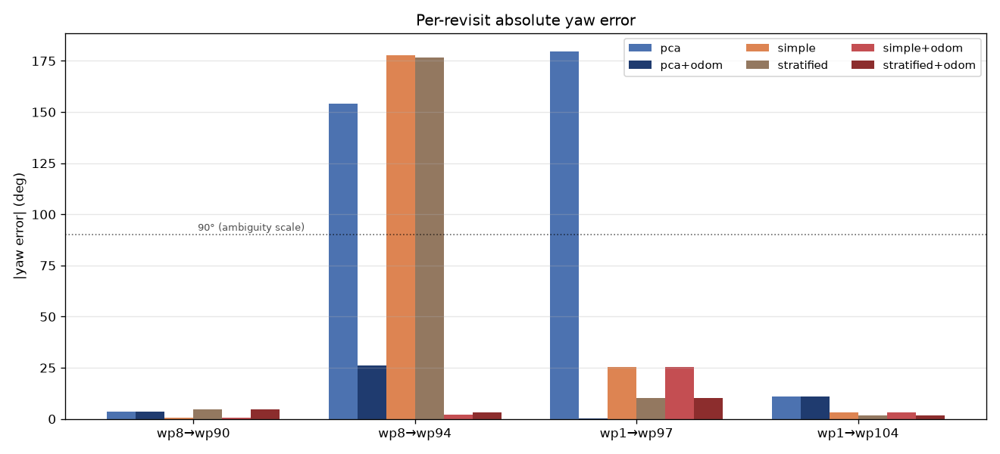
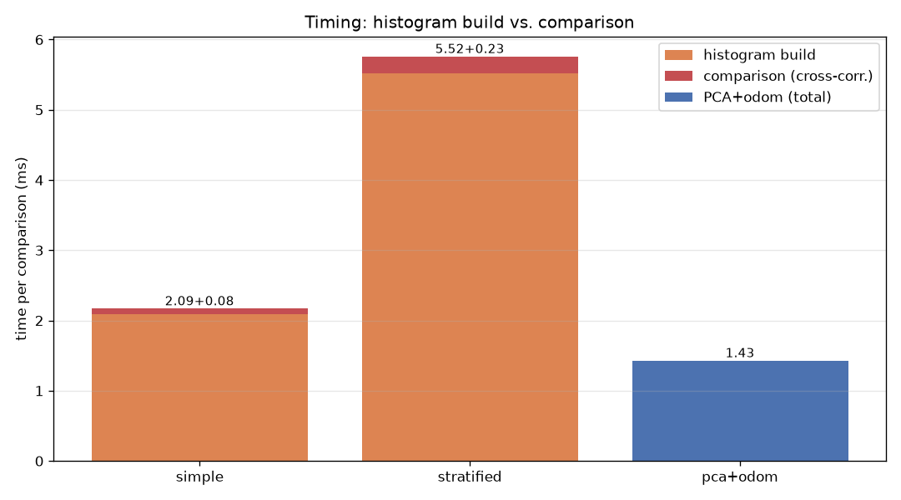
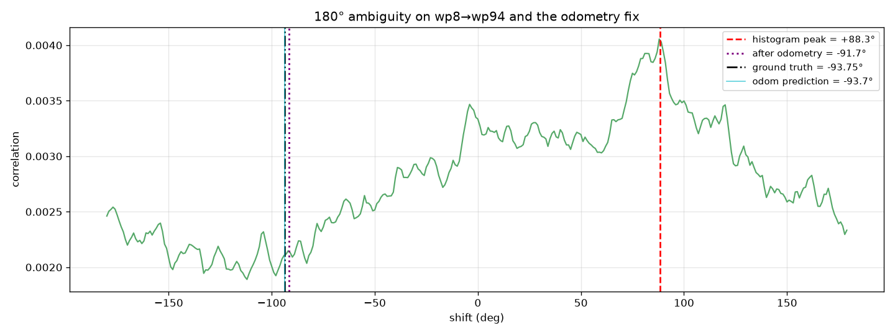
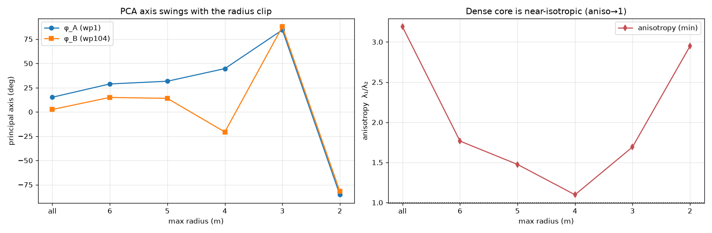
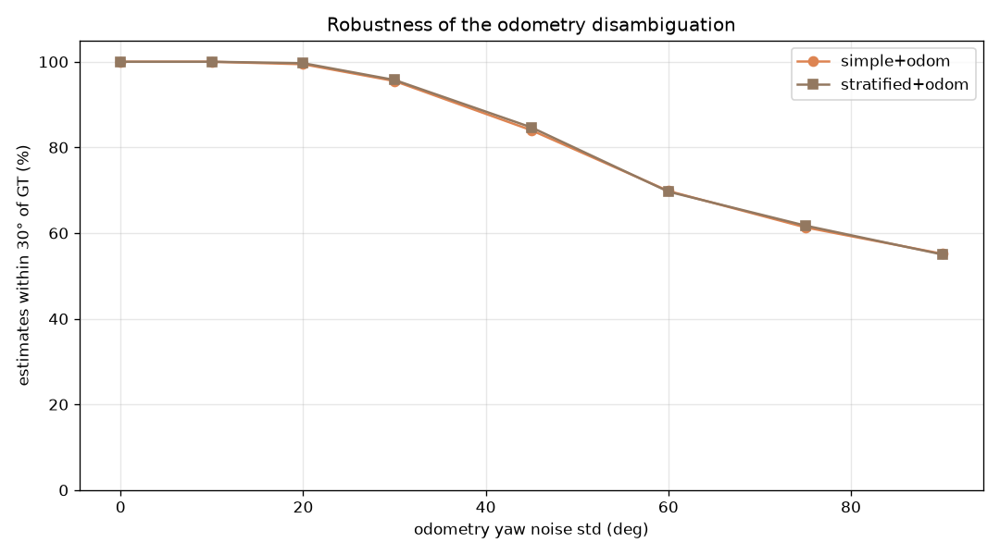
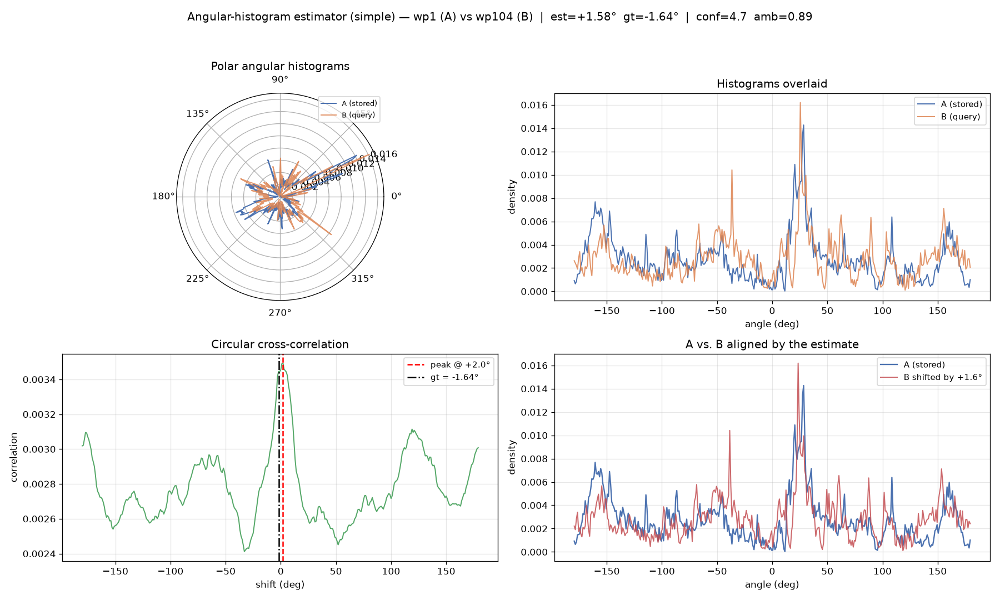

# Estimação de Yaw Relativo entre Revisitas de um Robô Quadrúpede: Comparação de Métodos Baseados em PCA-2D e Histogramas Angulares

**Relatório técnico — módulo `PointCloudRecognition`**
**Data:** 2026-10-06

---

## Resumo

Este relatório descreve e compara métodos para estimar o **yaw relativo** entre duas nuvens de pontos capturadas da *mesma localização* em momentos distintos (uma "revisita"). Foram avaliados dois pilares de métodos: **PCA-2D** (autodecomposição da matriz de covariância no plano XY) e **histogramas angulares** (distribuição das direções dos pontos em torno de uma âncora, correlacionada circularmente via FFT), nas variantes *simples* e *estratificada por anéis radiais*, cada uma com e sem **desambiguação por odometria**.

Sobre quatro revisitas reais de um conjunto de dados de um robô Spot (105 nuvens), o melhor método foi o **histograma estratificado com desambiguação por odometria**, com erro médio absoluto de **5,1°** (mediana 4,1°, pior caso 10,3°), contra **10,2°** do PCA-2D com odometria. Os erros grosseiros de ~180° (ambigüidade de simetria bilateral) que aparecem nas estimativas cruas — no PCA para wp1→wp97 e no PCA e nos histogramas para wp8→wp94 — foram eliminados pela odometria. Em um teste sintético com uma sala assimétrica, tanto o histograma simples quanto o estratificado recuperaram a rotação exata (erro 0,00°). A comparação de histogramas em si é muito barata (~0,08–0,23 ms), mas a **construção** dos histogramas domina o custo (~2,1–5,2 ms), tornando o PCA (~1,4 ms) o método mais rápido.

---

## 1. Contexto e objetivo

Em reconhecimento de lugares (*place recognition*), o sistema identifica quando o robô revisita um local já visto. Ao casar uma nova nuvem com uma nuvem armazenada, é necessário estimar a rotação relativa em torno do eixo vertical (o *yaw*) para alinhar as observações e refinar o fechamento de laço (*loop closure*).

Considerando duas nuvens $A$ (armazenada) e $B$ (consulta), ambas do mesmo lugar, deseja-se estimar:

$$\Delta\psi = \psi_B - \psi_A \pmod{360^\circ}$$

O conjunto de dados usado contém trajetória com *ground truth* (GT) de pose por waypoint, o que permite medir o erro de cada estimativa e simular **odometria** (pose aproximada, com deriva) para desambiguação.

---

## 2. Dados e protocolo experimental

* **Conjunto:** 105 nuvens de pontos `.npy` (`wp_0000` … `wp_0104`), capturadas cronologicamente, mais `trajectory_map_ros2.json` com as poses de GT.
* **Revisitas avaliadas (pares *stored* → *query*):**

  | par | $\Delta$wp | GT $\Delta\psi$ |
  |---|---|---|
  | wp8 → wp90 | 82 | −5,80° |
  | wp8 → wp94 | 86 | −93,75° |
  | wp1 → wp97 | 96 | +174,89° |
  | wp1 → wp104 | 103 | −1,64° |

* **Binning angular:** 360 bins (1° de resolução).
* **Estratificação:** 10 anéis radiais, com pesos crescentes para anéis externos.
* **Métricas:**
  * **Erro:** $\operatorname{wrap}(\hat{\psi} - \psi_{GT})$, com estatísticas $\text{média}|\cdot|$, mediana e máximo.
  * **Confiança:** razão pico/lóbulos-laterais da correlação (*peak-to-sidelobe ratio*).
  * **Ambigüidade:** razão entre o 2º e o 1º pico.
  * **Tempo:** mediana de 5 execuções, separando *construção* do histograma e *comparação* (correlação).

### 2.1 Pipeline de avaliação



---

## 3. Métodos

### 3.1 PCA-2D

Projeta-se cada nuvem no plano XY, centraliza-se no centróide e calcula-se a covariância $2\times2$:

$$C=\frac{1}{N}\sum_i \tilde{p}_i\tilde{p}_i^{\mathsf T}=\begin{bmatrix}s_{xx}&s_{xy}\\ s_{xy}&s_{yy}\end{bmatrix},\qquad \tilde{p}_i = (x_i-\bar{x},\,y_i-\bar{y})$$

O ângulo do eixo principal é obtido em forma fechada:

$$\varphi=\tfrac{1}{2}\operatorname{atan2}\!\big(2s_{xy},\;s_{xx}-s_{yy}\big)\in(-\pi/2,\pi/2]$$

e o yaw relativo é $\Delta\psi = \operatorname{wrap}(\varphi_B-\varphi_A)$.

A **anisotropia** é a razão dos autovalores:

$$\text{aniso}=\frac{\lambda_1}{\lambda_2},\qquad \lambda_{1,2}=\frac{s_{xx}+s_{yy}}{2}\pm\sqrt{\left(\frac{s_{xx}-s_{yy}}{2}\right)^2+s_{xy}^2}$$

Quando $\text{aniso}\to 1$ a nuvem é isotrópica (um "borrão") e o eixo **não está bem definido**; a incerteza angular do eixo cresce como $\sigma_\varphi \propto 1/\big(\sqrt{N}(\text{aniso}-1)\big)$.

**Ambigüidade:** o eixo é uma *reta*, não uma seta; a estimativa é ambígua módulo 180°.

### 3.2 Histograma angular simples

Para cada nuvem, calcula-se $\theta_i = \operatorname{atan2}(y_i-c_y,\;x_i-c_x)$ para todos os pontos (âncora = centroide XY ou origem do sensor), e bina-se em $N$ bins sobre $(-\pi,\pi]$, normalizando para densidade:

$$h[k]=\frac{\#\{i:\theta_i\in\text{bin}_k\}}{N}$$

A estimativa é o deslocamento que maximiza a **correlação cruzada circular** entre os histogramas de $A$ e $B$:

$$\hat{k}=\arg\max_k\;(\text{corr})[k],\qquad (\text{corr})[k]=\sum_n h_A[n]\,h_B[n+k]$$

calculada eficientemente por FFT: $\text{corr}=\text{IFFT}\big(\overline{\text{FFT}(h_A)}\cdot\text{FFT}(h_B)\big)$. O yaw é $\hat{\psi}=2\pi\hat{k}/N$, com refinamento sub-bin por interpolação parabólica.

**Observação conceitual:** o histograma é das *direções dos pontos em torno de uma âncora* (a nuvem vista de um ponto), **não** um histograma de normais/superfícies locais.

**Ambigüidade:** uma cena com simetria bilateral produz dois picos de correlação separados de ~180°.

### 3.3 Histograma estratificado

Divide-se os pontos em $n_{rings}$ anéis concêntricos (por quantis de raio) e calcula-se um histograma angular $h^{(r)}[k]$ por anel. As correlações de todos os anéis são combinadas:

$$\text{combined}[k]=\sum_{r} w_r\,\sum_n h_A^{(r)}[n]\,h_B^{(r)}[n+k]$$

com pesos $w_r$ crescentes para anéis externos (mais diversidade espacial, menos influência de oclusão próxima). Isso preserva a distribuição conjunta $(\theta, r)$ e ajuda a distinguir cenas com simetria.

### 3.4 Desambiguação por odometria

Tanto o PCA quanto os histogramas podem escolher o "lado errado" (±180°). A odometria fornece uma previsão grosseira:

$$\Delta\psi_{odom}=\operatorname{wrap}(\psi_B^{odom}-\psi_A^{odom})$$

Como a deriva entre duas passagens pelo mesmo lugar é tipicamente muito menor que o período de ambigüidade, escolhe-se o candidato mais próximo da previsão:

$$\hat{\psi}=\arg\min_{c\in\{\psi,\ \psi+\pi\}}\big|\operatorname{wrap}(c-\Delta\psi_{odom})\big|$$

A implementação é genérica no período (`period_rad`), permitindo outras simetrias (p.ex. $120^\circ$).

### 3.5 Medição de tempo

Separa-se o custo de **construção** (dois histogramas / PCA) do custo de **comparação** (correlação cruzada / decisão de odometria), reportando a mediana de 5 execuções.

---

## 4. Resultados

### 4.1 Validação sintética

Uma sala assimétrica sintética (três paredes de comprimentos distintos) foi rotacionada em $15^\circ$ de $-150^\circ$ a $+150^\circ$. Ambos os histogramas recuperaram a rotação com **erro 0,00°** (média e máximo), confirmando a corretude da implementação e da convenção de sinal.



*Figura 1 — Recuperação da rotação conhecida em uma cena assimétrica.*

### 4.2 Comparação geral por método

| método | média \|err\| | mediana \|err\| | máx \|err\| | tempo (ms) |
|---|---|---|---|---|
| `pca` | 87,06° | 82,49° | 179,66° | ~1,4 |
| `pca+odom` | 10,23° | 7,29° | 25,99° | ~1,4 |
| `simple` | 51,86° | 14,40° | 177,94° | ~2,1 |
| `stratified` | 48,36° | 7,58° | 176,62° | ~5,5 |
| `simple+odom` | 7,89° | 2,64° | 25,57° | ~2,1 |
| **`stratified+odom`** | **5,05°** | 4,12° | **10,29°** | ~5,5 |



*Figura 2 — Erro de yaw por método (média, mediana e máximo sobre as 4 revisitas).*

Duas leituras imediatas:

1. **Sem odometria, todos os métodos são reféns da ambigüidade** — a média é dominada pelos casos de ~180°.
2. **Com odometria**, o histograma estratificado lidera (5,05° média, 10,29° pior caso), seguido do histograma simples (7,89°) e do PCA (10,23°).

### 4.3 Erro por revisita



*Figura 3 — Erro absoluto por revisita e por método.*

| par | pca | pca+odom | simple | stratified | simple+odom | stratified+odom | GT |
|---|---|---|---|---|---|---|---|
| wp8→wp90 | −9,41 | −9,41 | −5,08 | −0,93 | −5,08 | −0,93 | −5,80 |
| wp8→wp94 | +112,24 | −67,76 | +88,31 | +89,63 | **−91,69** | **−90,37** | −93,75 |
| wp1→wp97 | −4,78 | +175,22 | +149,32 | +164,59 | +149,32 | +164,59 | +174,89 |
| wp1→wp104 | −12,61 | −12,61 | **+1,58** | **+0,03** | +1,58 | +0,03 | −1,64 |

Observações relevantes:

* Em **wp1→wp104**, os histogramas acertam quase perfeitamente (+1,58° e +0,03°), enquanto o PCA erra 12,6° — o PCA foi enganado por *outliers* distantes (ver §4.6).
* Em **wp8→wp94**, as estimativas cruas dão ~+90°, que está **exatamente 180° deslocado** do GT −93,75°.
* Em **wp1→wp97** (GT ≈ +175°), é o **PCA cru** que cai na ambigüidade (retorna −4,78°, ~180° deslocado); a odometria o corrige para +175,22° (erro +0,33°). Os histogramas, sem inversão, já ficam a 10–26°.

### 4.4 Tempo de execução



*Figura 4 — Construção do histograma vs. comparação (e total do PCA+odom).*

| método | construção | comparação | total |
|---|---|---|---|
| `simple` | 2,05 ms | **0,08 ms** | 2,13 ms |
| `stratified` | 5,21 ms | **0,23 ms** | 5,45 ms |
| `pca+odom` | — | — | **1,42 ms** |

**A comparação de histogramas é extremamente barata (< 0,25 ms)**; o custo está na *construção* dos histogramas (varrer os ~30 mil pontos duas vezes: `arctan2` + `np.histogram`). Por isso o PCA acaba sendo o método mais rápido no total (~1,4 ms), enquanto o histograma estratificado custa ~3,8× mais.

### 4.5 O caso da ambigüidade de 180° e o conserto



*Figura 5 — wp8→wp94: pico global em +88,3°, mas um pico secundário próximo de −92°. A odometria (−93,7°) seleciona o candidato correto.*

O par wp8→wp94 é paradigmático: a correlação tem um máximo global em +88,3° e uma região secundária forte perto de −92°, separados por ~180° (simetria bilateral). A desambiguação por odometria move a estimativa de +88,31° para **−91,69°** (erro 2,06°), e o mesmo ocorre no estratificado (−90,37°, erro 3,38°).

### 4.6 O modo de falha do PCA: *outliers* dominando a covariância



*Figura 6 — O eixo principal do PCA oscila fortemente conforme se recorta o raio, e a anisotropia cai para ≈1,1 na região densa.*

No par wp1→wp104, o PCA retorna −12,61° (erro ~11°) enquanto o histograma simples acerta +1,58°. A causa: ~10–13 % dos pontos estão muito distantes (até ~42 m) e, por entrarem ao quadrado na covariância, **definem o eixo principal**. A estimativa oscila de −12,6° a −65,3° a +3,2° dependendo de pouquíssimos pontos, e a anisotropia do núcleo denso (raio ≤ 4 m) cai para **1,10…1,51** — ou seja, o núcleo é quase isotrópico e o eixo é mal condicionado. A "anisotropia alta" da nuvem cheia (~3–4) é um artefato dos *outliers*, não um sinal de confiabilidade.

### 4.7 Robustez da desambiguação à deriva de odometria



*Figura 7 — Fração de estimativas dentro de 30° do GT conforme cresce o ruído Gaussiano de odometria (300 sorteios por nível).*

A desambiguação mantém **100 % de acerto até ~20°** de ruído de odometria e cai gradativamente, aproximando-se de ~55 % em 90°. Isso é coerente: como a ambigüidade é de 180°, basta que a odometria erre menos que 90°; a partir daí as duas hipóteses ficam indistinguíveis.

### 4.8 Ilustração do estimador por histograma



*Figura 8 — Estimador por histograma simples no par wp1→wp104: histogramas (polar e linear), correlação cruzada com o pico marcado (−1,64° do GT) e alinhamento de B sobre A.*

O pico da correlação coincide com o GT (confiança 4,7; ambigüidade 0,89) e o painel de alinhamento mostra B deslocado casando com A.

---

## 5. Discussão

* **PCA-2D** é rápido e funciona bem quando a cena tem estrutura alongada e não há *outliers* dominantes. É, porém, frágil: (i) é ambíguo módulo 180°; (ii) a direção é mal condicionada quando a nuvem é isotrópica; (iii) alguns pontos distantes podem definir o eixo inteiro. No conjunto avaliado, falhou justamente no par wp1→wp104.
* **Histogramas angulares** usam a distribuição global das direções, o que os torna robustos àquele tipo de *outlier* — desde que as distribuições de A e B sejam comparáveis. O **estratificado** melhora a discriminação (menor mediana e pior caso) ao custo de ~2,5× mais tempo de construção.
* **A desambiguação por odometria é o componente de maior impacto**: ela reduz o erro médio do histograma estratificado de 48,4° para 5,1° e elimina os erros grosseiros de ~180°. É também bastante tolerante (funciona até ~±20° de ruído de forma perfeita, degradando suavemente depois).
* **Custo:** a "comparação" em si (correlação por FFT) é desprezível (< 0,25 ms); o gargalo é a construção dos histogramas. Se o tempo for crítico, o PCA é o mais rápido, ou pode-se reduzir `n_bins`/`n_rings` ou reaproveitar histogramas pré-computados (as nuvens armazenadas poderiam mantê-los em cache).

---

## 6. Conclusões e recomendações

1. **Recomendação principal:** usar o **histograma estratificado + odometria** (`--yaw-method stratified+odom`), que obteve o menor erro médio (5,1°) e o menor pior caso (10,3°).
2. Manter o **PCA como alternativa de baixo custo** (~1,4 ms) quando a estrutura for confiável; mas monitorar a **anisotropia robusta** e recusar estimativas quando ela for baixa (≈1).
3. A **desambiguação por odometria deve ser sempre aplicada** — é barata e elimina a falha dominante.
4. Para reduzir o custo dos histogramas, considerar **cachear** os histogramas das nuvens armazenadas e/ou reduzir `n_bins`/`n_rings`.

---

## 7. Reprodutibilidade

Todas as figuras e tabelas deste relatório são geradas por um único script:

```bash
# requer o venv do projeto (com os bindings htm)
MPLBACKEND=Agg /home/fabio/htm.core/.venv/bin/python report_yaw_experiments.py
# saídas:
#   yaw_report/figures/*.png
#   yaw_report/results.csv
```

Scripts relacionados:

| arquivo | função |
|---|---|
| `src/yaw_estimator.py` | histogramas simples/estratificado + desambiguação por odometria |
| `src/yaw_estimator_pca.py` | PCA-2D + desambiguação por odometria |
| `test_pipeline_revisits.py` | pipeline fim-a-fim e comparação de métodos (`--yaw-method`) |
| `visualize_histogram_yaw.py` | visualização do histograma (opcional `--odom-disambiguate`) |
| `report_yaw_experiments.py` | gera as figuras e métricas deste relatório |

---

## Apêndice — Arquivos de saída

| arquivo | conteúdo |
|---|---|
| `yaw_report/figures/fig1_synthetic.png` | validação sintética |
| `yaw_report/figures/fig2_methods_summary.png` | erro médio/mediano/máx. por método |
| `yaw_report/figures/fig3_per_pair_errors.png` | erro absoluto por revisita |
| `yaw_report/figures/fig4_timing.png` | tempo de construção vs. comparação |
| `yaw_report/figures/fig5_odom_flip.png` | ambigüidade de 180° e correção por odometria |
| `yaw_report/figures/fig6_pca_outliers.png` | modo de falha do PCA |
| `yaw_report/figures/fig7_odom_robustness.png` | robustez à deriva de odometria |
| `yaw_report/figures/fig8_histogram_illustration.png` | ilustração do estimador por histograma |
| `yaw_report/results.csv` | métricas por par e por método |
