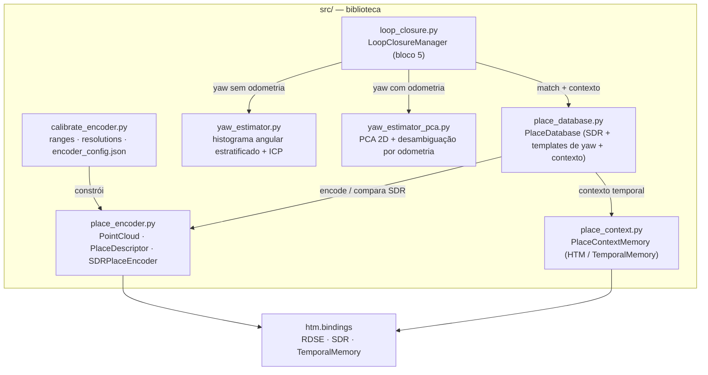
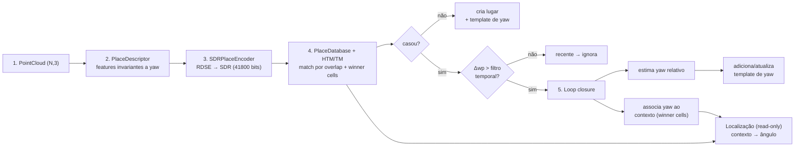
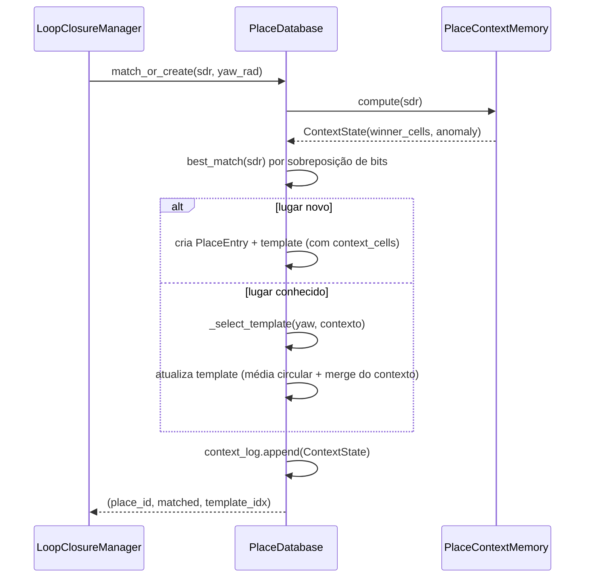
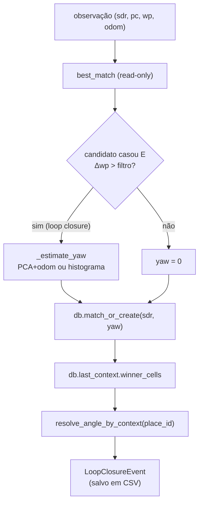
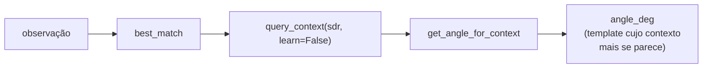
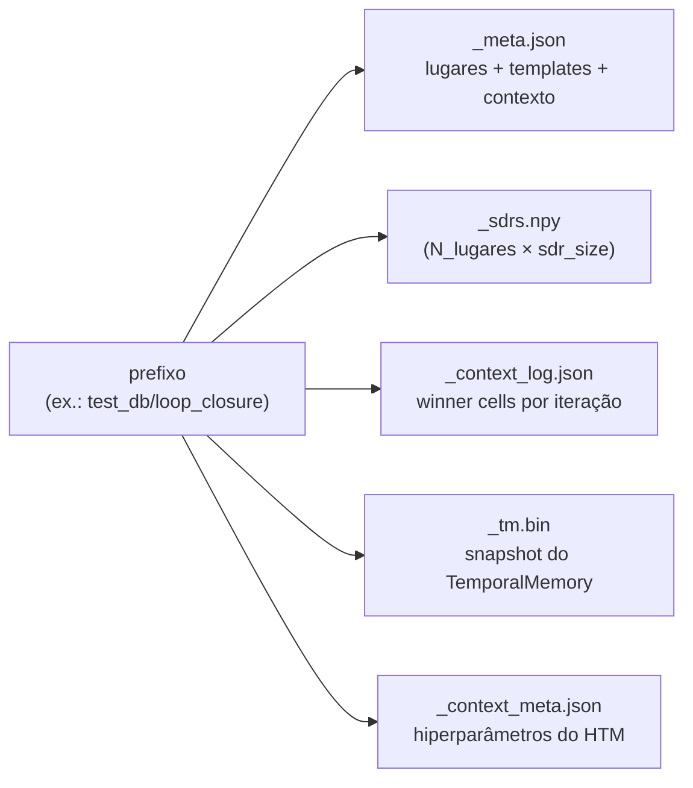
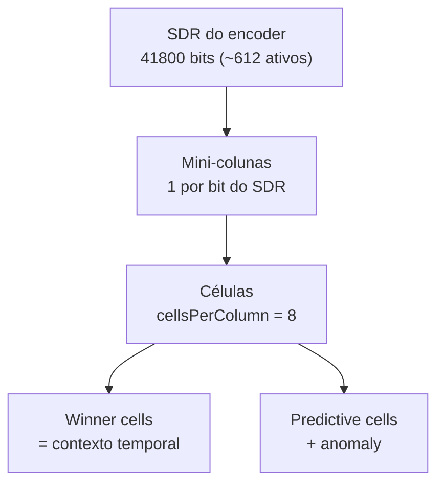

# Pipeline de Reconhecimento de Lugares — PointCloudRecognition

Documentação do pipeline atual: do **point cloud** bruto até **loop closure**,
**estimativa de yaw relativo** e **uso do contexto temporal do HTM** para
selecionar o ângulo correto durante a localização.

> Pasta do projeto: `py/htm/examples/PointCloudRecognition/`
> Dataset usado nos testes: `/home/fabio/Documents/SPOT_Data/extracted_spot_ros2_data`
> (105 nuvens `.npy` cronológicas `wp_0000 … wp_0104` + `trajectory_map_ros2.json`).

---

## 1. Visão geral

O sistema responde a três perguntas:

1. **"Já visitei este lugar?"** → casamento de SDR por sobreposição de bits.
2. **"Em que contexto?"** → células vencedoras (*winner cells*) do HTM/TM, que
   codificam a sequência de lugares que levou até aqui.
3. **"Qual o ângulo correto?"** → o contexto seleciona o *template de yaw*
   correto entre os vários ângulos já registrados para aquele lugar.

Números típicos no dataset: **105 nuvens → 95 lugares, 10 matches, 4 loop
closures**, com SDR de **41800 bits** (~612–630 ativos).

---

## 2. Mapa dos módulos

Diagrama de dependências entre os arquivos de `src/`:



**Configuração persistida:** `src/encoder_config.json` (ranges, resoluções,
tamanhos e bits ativos por feature) — gerado por `calibrate_encoder.py` e
consumido por `load_encoder_from_config()`.

---

## 3. Pipeline ponta-a-ponta

Mapeamento dos blocos do diagrama original (`Images/PCD_HTM_pipeline.png`) para
o código:



| Bloco | Responsabilidade | Arquivos |
|------:|------------------|----------|
| 1 | Point cloud bruto | `place_encoder.PointCloud` |
| 2 | Descritores invariantes a yaw | `place_encoder.PlaceDescriptor` |
| 3 | Encoder → SDR | `place_encoder.SDRPlaceEncoder`, `calibrate_encoder.py` |
| 4 | HTM / contexto temporal | `place_context.PlaceContextMemory`, `place_database.PlaceDatabase` |
| 5 | Loop closure + yaw + contexto | `loop_closure.LoopClosureManager`, `yaw_estimator*.py` |

---

## 4. Fluxo de dados detalhado

### 4.1 Bloco 4 — `match_or_create` (banco de lugares + HTM)



### 4.2 Bloco 5 — `LoopClosureManager.observe`



### 4.3 Localização (inferência, sem aprender)



---

## 5. Lógica de cada arquivo Python

### 5.1 `src/place_encoder.py` — nuvem, descritores e encoder

- **`PointCloud`** (dataclass): encapsula `points (N,3)` no referencial do
  sensor. Propriedades geométricas (`centroid`, `xy`, `z`, `r_xy`), construtor
  `from_npy()` e `rotated_yaw(angle)` (rotação em torno de Z, usada nos testes).
- **`PlaceDescriptor`** (dataclass): **descritor invariante a yaw** ancorado na
  **origem do sensor** (não no centróide, que varia com a amostragem). Features
  em `to_vector()` (30 no total):
  - 3 autovalores da covariância 3D (rotação-invariantes);
  - `hist_z` (10 bins) e `hist_r` (10 bins), normalizados;
  - escalares: `height`, `density`, `volume`, `mean_radius`, `std_radius`,
    `mean_height`, `std_height`.
  Também oferece `distance_to()` e `correlation_with()`.
- **`SDRPlaceEncoder`**: cria **um encoder RDSE por feature** (cada uma com seu
  `range`, `resolution`, `size` e `activeBits`), codifica o vetor de descritores
  e **concatena** os SDRs num único vetor `0/1` de tamanho `total_size`
  (41800 bits). Faz checagens de sanidade (buckets vs. size).

### 5.2 `src/calibrate_encoder.py` — calibração e persistência do encoder

Define o **esquema de features** (`FEATURE_NAMES`, limites físicos inferior/
superior) e o fluxo de calibração:

1. `collect_global_stats()` — roda `PlaceDescriptor` em todas as nuvens, com
   rejeição de *outliers* (poucos pontos, `mean_radius`, `volume`, `eigval_1`).
2. `get_encoder_ranges()` — `(lo, hi)` por feature a partir de `p05`/`p95`,
   expandidos por `margin` e "clipados" pelos limites físicos.
3. `compute_resolutions()` — resolução por feature para um alvo de buckets.
4. `check_rdse_params()` / `build_encoder_from_stats()` — validam risco de
   colisão de hash e instanciam o `SDRPlaceEncoder`.
5. `save_encoder_config()` / `load_encoder_from_config()` — JSON.
6. Bloco `__main__`: recalibra tudo e escreve `encoder_config.json`.

O `encoder_config.json` resultante tem 30 features, `total_size = 41800`,
`active_bits = 21` por feature.

### 5.3 `src/place_context.py` — memória de contexto temporal (HTM)  *(novo)*

- **`PlaceContextMemory`**: wrapper do `TemporalMemory` do HTM cujo **input
  side = tamanho do SDR** (1 mini-coluna por bit do SDR, sem SpatialPooler,
  pois o SDR já é esparso).
  - `compute(sdr, learn, reset)` → `ContextState` com `winner_cells`,
    `active_cells`, `predictive_cells` e `anomaly`.
  - `save()/load()` (snapshot binário do TM + metadados JSON).
- **`ContextState`** (dataclass): snapshot por iteração; persistido como lista de
  índices de células (as *winner cells* são o "contexto temporal").
  Utilitários `overlap()` e `jaccard()` para comparar contextos.

> **Por que as winner cells?** Elas dependem da *sequência* de lugares que levou
> até aqui, não só do lugar atual. Duas visitas ao mesmo lugar, chegando por
> trajetórias diferentes, produzem conjuntos de winner cells diferentes — daí
> servirem para desambiguar contexto.

### 5.4 `src/place_database.py` — banco de lugares (SDR + yaw + contexto)  *(modificado)*

- **`AngularTemplate`**: um cluster de yaw (`mean_yaw_rad`, `visit_count`) mais o
  `context_cells` (união das winner cells vistas nesse template) e
  `context_visits`.
- **`PlaceEntry`**: um lugar (`sdr`, `angular_templates`, contadores, `label`).
  Propriedade `context_cells` = união dos contextos dos templates.
- **`PlaceDatabase`**:
  - `best_match(sdr)` → melhor lugar por `overlap / active_bits`.
  - `match_or_create(sdr, yaw_rad, …)`: apresenta o SDR ao TM, decide
    **casar vs. criar**, escolhe o **template** (`_select_template`), atualiza a
    média circular do yaw e **mescla o contexto**, e **registra o
    `ContextState` em `context_log`** (uma entrada por iteração).
  - `query_context(sdr, learn=False)` → contexto sem tocar no banco (localização).
  - `resolve_angle_by_context()` / `get_angle_for_context()` → **o contexto
    indica o ângulo**.
  - `save()/load()` → `_meta.json`, `_sdrs.npy`, `_context_log.json`, `_tm.bin`,
    `_context_meta.json`.

**Regras de seleção de template (`_select_template`):**

1. Candidatos dentro de `yaw_tolerance_deg`; entre eles vence o de **contexto
   mais parecido** (desempate: yaw mais próximo).
2. Se nenhum yaw está dentro da tolerância e `allow_context_angle_recovery=True`
   (opt-in), o contexto pode **recuperar** um template existente.
3. Caso contrário, **cria um novo template**.

> Por padrão `allow_context_angle_recovery=False`: o mapeamento é guiado pelo
> yaw (o encoder é *yaw-invariante*, então o contexto é um indício fraco para o
> yaw em si). O papel principal do contexto para o ângulo é a seleção **durante
> a localização**.

### 5.5 `src/loop_closure.py` — bloco 5  *(novo)*

- **`LoopClosureManager.observe(sdr, pc, wp_index, odom_yaw_rad, …)`**:
  1. `best_match` preliminar para identificar o lugar candidato;
  2. se é *revisita* (Δwp > `temporal_filter`): estima o **yaw relativo**;
  3. `db.match_or_create(...)` — atualiza templates e avança o HTM;
  4. recupera o contexto (`db.last_context`) e resolve o ângulo por contexto;
  5. devolve um **`LoopClosureEvent`** (yaw, anomalia, nº de winner cells,
     template escolhido, similaridade de contexto, etc.).
- **`localize(...)`**: consulta **read-only** (sem aprender). Retorna lugar,
  `angle_deg` selecionado pelo contexto e, se houver nuvem de referência, o yaw
  estimado.
- **`_estimate_yaw`**: usa `PCA + odometria` quando disponível; senão cai no
  histograma estratificado.

### 5.6 `src/yaw_estimator.py` — yaw por histogramas angulares

- **`angular_histogram()`**: histograma da distribuição de ângulos
  `atan2(y, x)` (em torno do centróide ou da origem do sensor).
- **`angular_histogram_stratified()`**: divide os pontos em **anéis radiais** e
  calcula um histograma angular por anel — preserva a informação
  `(θ, r)` e desambigua cenas com simetria bilateral.
- **`estimate_yaw_from_histograms()` / `…_from_stratified_histograms()`**:
  correlação cruzada **circular** (via FFT); o pico dá o yaw relativo, com
  refinamento parabólico sub-bin. Métricas: `confidence` (peak-to-sidelobe) e
  `ambiguity` (2º pico / 1º).
- **`refine_with_icp()`**: refino opcional com ICP 2D restrito a yaw
  (multi-start via `scipy.spatial.cKDTree`).
- **`estimate_yaw()`**: API de alto nível (`method="simple"` ou `"stratified"`).
- **`plot_yaw_diagnostics()`**: visualização dos histogramas e da correlação.

### 5.7 `src/yaw_estimator_pca.py` — yaw por PCA 2D (+ odometria)

- **`_pca_2d()`**: eixo principal em forma fechada
  `φ = ½·atan2(2·sxy, sxx − syy)`.
- **`estimate_yaw_pca()`**: `yaw = φ_B − φ_A`. É **ambíguo módulo 180°** (o eixo
  principal é uma reta, não uma direção). `resolve_180_with_z` tenta desambiguar
  por assimetria em Z.
- **`estimate_yaw_pca_with_odometry()`**: resolve a ambiguidade de 180° usando o
  *heading* aproximado da odometria (o drift entre duas passagens pelo mesmo
  lugar costuma ser muito menor que 180°).

### 5.8 `testing_scripts/` — testes, diagnóstico e demos

| Arquivo | O que faz |
|---|---|
| `test_point_cloud_descriptors.py` | Verifica **invariância a yaw** dos `PlaceDescriptor` (rotaciona a nuvem e compara `distance_to`/`correlation_with`); imprime features. |
| `test_sdr_yaw_invariance.py` | Mesma ideia **no espaço SDR**: mede sobreposição ao rotacionar a nuvem e testa a **discriminação** entre lugares distintos (Jaccard). |
| `diagnose_feature_redundancy.py` | Matriz de **correlação entre features** para achar redundâncias (guia os tamanhos por feature). |
| `inspect_outliers.py` | Distribuição de descritores de alto nível e **simulação de limiares de rejeição** (percentis, scatter, detalhe dos rejeitados). |
| `test_heigth_feats.py` | Estatísticas (`média`, `std`, `CV`, correlações) das features de altura. |
| `test_place_database.py` | Teste sintético do banco: 2 lugares, vários yaws, revisita; salva e recarrega. |
| `test_place_database_revisit.py` | Força revisitas (aprende a cada 10º wp, depois revisita) e demonstra **acumulação de templates** com yaws falsos. |
| `test_place_database_full.py` | Roda o **dataset completo** pelo `PlaceDatabase`, com tabela por waypoint, sumário e (opcional) plot dos pares que casaram. |
| `test_pipeline_revisits.py` | Pipeline de revisitas: decodifica → casa → filtra por Δwp → estima yaw; compara com *ground truth* e mede tempo; salva `revisits.csv`. |
| `test_yaw_estimator.py` | Testa o estimador de histogramas com **rotações sintéticas**, mede erro e **tempo** (histograma vs. histograma+ICP) e plota. |
| `test_yaw_diagnostics.py` | Visualiza histogramas/correlação do estimador para um par de waypoints, com opção de comparar com o GT. |
| `test_yaw_pca.py` | Avalia o **PCA** nos 4 revisitas (erro mod 360° e mod 180°, anisotropia). |
| `test_yaw_pca_odom.py` | **PCA + odometria** com ruído crescente (0, 5, 15, 30°) comparando PCA puro vs. PCA+odom. |
| `visualize_match.py` | Plota dois point clouds lado a lado para inspeção visual de um casamento. |
| `test_loop_closure.py` | **Demo dos blocos 4+5** (novo): roda o dataset, gera `loop_closure_events.csv`, salva o banco com HTM e (com `--localize`) recarrega e re-localiza mostrando contexto→ângulo. |

Artefatos gerados: `revisits.csv`, `loop_closure_events.csv`, `test_db/*`.

---

## 6. Persistência



- `PlaceDatabase.load(prefix)` restaura tudo; se os arquivos de contexto não
  existirem, carrega sem HTM (compatível com bancos antigos).
- O encoder é persistido separadamente em `src/encoder_config.json`.

---

## 7. Como executar

Use o **Python do virtualenv** do projeto (o `python` do shell pode não ter o
pacote `htm`):

```bash
cd py/htm/examples/PointCloudRecognition/testing_scripts
PY=/home/fabio/htm.core/.venv/bin/python

# Demo completa dos blocos 4 + 5 (mapeamento + localização read-only)
$PY test_loop_closure.py --no-verbose --localize

# Pipeline de revisitas (yaw vs. ground truth)
$PY test_pipeline_revisits.py --plot

# Banco de dados no dataset completo
$PY test_place_database_full.py --plot-matches --max-plots 20

# Recriar o encoder_config.json
$PY ../src/calibrate_encoder.py
```

---

## 8. Parâmetros importantes

| Onde | Parâmetro | Default | Efeito |
|---|---|---|---|
| `PlaceDatabase` | `match_threshold` | 0.5 (scripts: 0.85) | Sobreposição mínima p/ "mesmo lugar". |
| `PlaceDatabase` | `yaw_tolerance_deg` | 15.0 | Distância angular p/ mesmo template de yaw. |
| `PlaceDatabase` | `enable_context` | `True` | Liga o HTM e o log de contexto. |
| `PlaceDatabase` | `cells_per_column` | 8 | Células por mini-coluna do TM. |
| `PlaceDatabase` | `allow_context_angle_recovery` | `False` | Deixa o contexto recuperar template fora da tolerância de yaw. |
| `LoopClosureManager` | `temporal_filter` | 5 | Δwp mínimo para contar como loop closure. |
| `LoopClosureManager` | `yaw_method` | `"pca_odom"` / `"stratified"` | Estratégia de estimativa de yaw. |

---

## 9. Diagrama do TM (mini-colunas)



---

## 10. Decisões de projeto e limitações

- **Sem SpatialPooler:** o SDR do encoder já é esparso e de alta dimensão, então
  o "input side" do HTM é o próprio SDR.
- **Mapeamento guiado por yaw:** como o encoder é *yaw-invariante*, o contexto
  temporal é um indício fraco para o yaw durante o mapeamento. Por isso o
  contexto **seleciona o ângulo na localização** (`resolve_angle_by_context`), e
  a sobrescrita de yaw por contexto é opt-in (`allow_context_angle_recovery`).
- **PCA é ambíguo módulo 180°:** requer odometria (mesmo ruidosa) para
  desambiguar; sem odometria, usa-se o histograma estratificado.
- **`yaw_estimator.py`** ainda contém dois `print("[debug] …")` no caminho
  estratificado que poluem a saída — candidatos a remoção.
